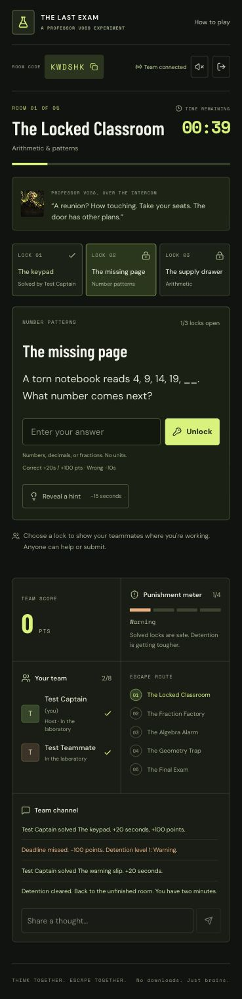
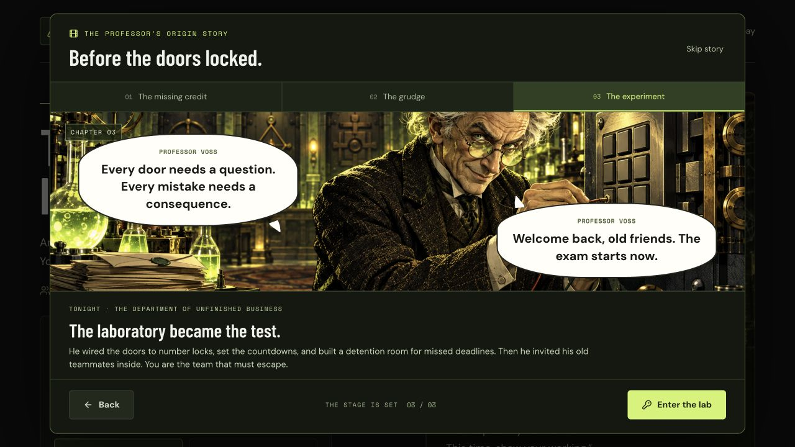

# The Final Exam — A Multiplayer Math Escape Room

**In-game title: The Professor’s Last Exam.** A cooperative browser game for **2–8 players**, where each player joins from their own device using a six-letter room code. Professor Elias Voss has turned a college reunion into a timed examination. Your team must solve five rooms to escape.

> An old grudge. Five locked rooms. Your only way out? Do the math.

School-level math, a ticking countdown, and teamwork create the challenge. The team shares one score and one punishment meter; players are not eliminated individually. Choose **Junior (classes 5–8)** or **Senior (classes 9–12)**. Questions become harder as the rooms progress, while detention adds an extra escape challenge when the team misses a deadline.

## Features

- Room creation, code-based joining, readiness, and host controls for 2–8 players.
- Shared puzzle progress, countdowns, scoring, hints, and a team chat channel.
- Five themed rooms, with three locks in each room and two difficulty modes.
- Three escalating detention levels, followed by a final loss condition.
- An animated manga prologue with HD artwork, white dialogue bubbles, and replay controls.
- Mobile layouts, reduced-motion support, optional game sounds, and session reconnection.

## Preview



## Animated origin story

### What happened to Professor Voss?

Thirty years ago, Elias Voss spent months working on his college team's mathematics research. At the science fair, his classmates accepted the award while his name was missing from the credits. Hurt and furious, he walked away before they could explain.

The team's letters remained unopened. Voss kept the old photograph and research notes in his laboratory, replaying the moment until an omission became a betrayal in his mind. A college reunion gave him the opportunity for revenge: if his friends wanted to leave, they would have to earn their way out.

He wired his science laboratory's doors to numerical locks, installed countdowns, and built a detention room for missed deadlines. The reunion invitations were sent. His old teammates arrived. The final exam began.

You play as the invited team. Cooperation, quick thinking, and familiar mathematics are your escape tools.

### How the story is presented

First-time visitors see three manga scenes: the missing research credit, Voss's growing grudge, and the laboratory becoming an escape room. HD illustrations use gentle camera movement and arriving white speech bubbles. Dialogue is HTML text, so it stays crisp and readable as the screen changes size. Use **Pause**, chapter tabs, **Back**, **Next scene**, or **Skip story**. Replay with **The backstory** outside a running puzzle countdown. Reduced-motion preferences disable autoplay and animation.

The prologue belongs to the individual device; it never changes the shared game clock. Returning players reconnect directly. [Artwork and generation notes](docs/story-art.md) document the three panels.



## How to play

1. Create a room, enter your name, and choose **Junior (classes 5–8)** or **Senior (classes 9–12)**.
2. Share the room code or invitation link. Each teammate opens the same website on their own device and joins.
3. Everyone clicks **I’m ready**. The host starts the experiment and participates too.
4. Choose a lock, share your reasoning in the team channel, and submit a numerical answer. Fractions such as `3/8` and equivalent decimals are accepted.
5. Solve all three locks to clear a room. The host opens the next room when the team has read the explanations.

You can work on different locks at the same time. Use the team channel to compare reasoning, ask for help, and coordinate submissions. Everyone sees the same solved locks and hints. A correct answer from any teammate helps the entire team.

Enter only the numerical result, without units. Fractions and equivalent decimals are accepted; there is no need to type the full equation. Invalid input shows a validation message without a time penalty. Once a lock opens, its worked explanation becomes available.

### Your escape route

| Room                    | Theme                          | Junior examples                       | Senior examples                                 |
| ----------------------- | ------------------------------ | ------------------------------------- | ----------------------------------------------- |
| 1. The Locked Classroom | Arithmetic and patterns        | Order of operations, number sequences | Signed numbers, more involved patterns          |
| 2. The Fraction Factory | Fractions, ratios, percentages | Fractions of amounts, discounts       | Fraction addition, successive percentages       |
| 3. The Algebra Alarm    | Equations and powers           | One-step and two-step equations       | Linear equations, exponent rules, square roots  |
| 4. The Geometry Trap    | Shapes and measurements        | Area, perimeter, triangle angles      | Pythagoras, circle area, a trigonometric ratio  |
| 5. The Final Exam       | Mixed final challenge          | Equations, probability, averages      | Simultaneous equations, probability, quadratics |

These are approachable questions within the selected school-level range, not complete coverage of every class syllabus. Geometry formulas needed for a question are included in its prompt.

## Rules and scoring

| Event                                         | Result                                                                            |
| --------------------------------------------- | --------------------------------------------------------------------------------- |
| Start a main room                             | Four-minute countdown                                                             |
| Correct answer                                | +20 seconds; +100 points for a main-room puzzle                                   |
| Incorrect numerical answer                    | −10 seconds                                                                       |
| Reveal a puzzle’s hint                        | −15 seconds, once per puzzle for the whole team                                   |
| Clear a main room                             | One bonus point per whole second remaining                                        |
| Main-room timeout                             | −100 points, minimum score zero; punishment increases                             |
| Detention level 1                             | One puzzle; 60 seconds                                                            |
| Detention level 2                             | Two puzzles; 90 seconds                                                           |
| Detention level 3                             | Two fragments and a dependent exit-code puzzle; 120 seconds                       |
| Clear detention                               | Return to the unfinished room with two minutes; solved main puzzles remain solved |
| Fail detention or miss a fourth main deadline | The escape attempt ends                                                           |
| Clear all five main rooms                     | The team escapes and receives the ending                                          |

Detention questions use familiar, simpler math in both modes. Correct detention answers add 20 seconds but do not award puzzle points. Wrong submissions and hints use the same penalties. Invalid input produces a validation message and no penalty. Refreshing restores the player session on the same browser; explicitly leaving removes membership. If a host disconnects for 30 seconds, a connected teammate becomes host.

### How punishment works

Punishment is shared and accumulates across the whole escape attempt. It increases when the main-room countdown expires, including when penalties push the remaining time to zero. A wrong answer by itself removes time; it does not immediately raise the punishment level.

1. **Warning:** solve one detention puzzle in 60 seconds.
2. **Detention:** solve two detention puzzles in 90 seconds.
3. **Final probation:** solve two fragments, then use them to unlock a dependent exit-code puzzle in 120 seconds.
4. **Fourth missed main deadline:** the attempt ends immediately.

Clearing detention sends you back to the unfinished main room with two minutes. Already solved main-room locks stay open. Clearing detention does not reset the punishment meter. Fail a detention deadline and the attempt ends.

### When the game ends

**Win:** clear all three locks in each of the five main rooms. The team receives its final shared score and the story ending.

**Lose:** fail a detention deadline or miss a fourth main-room deadline. Review the attempt and puzzle explanations, then start another run.

<details>
<summary>Story ending — spoilers</summary>

An unopened letter reveals that Voss's missing credit was a printing error. His friends tried to correct it and contact him, but he never read their messages. The team's escape shows him that cooperation was the answer all along.

</details>

## Run locally

Requires **Node.js 22.13+** and npm. This standalone game uses React, TypeScript, Vinext, Cloudflare Workers and D1 (SQLite). Its backend is TypeScript rather than Flask so the whole multiplayer experience can run on Sites hosting.

```sh
git clone https://github.com/Sujay1709/The-Final-Exam---A-Multiplayer-Game.git
cd The-Final-Exam---A-Multiplayer-Game
npm ci
npm run build
node --import ./scripts/sites-env.mjs ./node_modules/wrangler/bin/wrangler.js d1 execute DB --local --config dist/server/wrangler.json --persist-to .wrangler/state --file drizzle/0000_spotty_toad_men.sql
npm run dev
```

Run the migration once for a new local database. It uses local storage only. The development server prints its URL, normally `http://127.0.0.1:5173`. `vite.config.ts` listens on `0.0.0.0` so phones on the same Wi-Fi can open `http://YOUR_COMPUTER_LAN_IP:5173`. Keep the server running and the computer awake. `127.0.0.1` on a phone points at the phone itself. Local sign-in is mocked by the starter; development mode is not a public deployment.

Your router may assign a different LAN IP after a restart or network change. Joining and actions also work over plain local HTTP: the client generates request IDs with `crypto.getRandomValues`, which is available there, rather than the HTTPS-only `crypto.randomUUID` method.

The shared database owns room state. Browser storage holds only the current player's session credential; never share it. Rooms expire after 24 hours. New players can join while the lobby is open. Existing players reconnect on their original device.

## Verify

```sh
npm test
npm run typecheck
# With the local server running:
node tests/integration.mjs
```

The rules tests use a controlled clock to exercise all detention levels without waiting several minutes. They cover complete Junior/Senior paths, equivalent numerical inputs, deadlines, scoring, duplicate actions, hidden solutions and host migration.

The HTTP test connects **eight independent player sessions** to the actual local API. It checks capacity, permissions, concurrent submissions, shared hints, chat, replay protection and room progression. It creates a disposable test room and removes its player memberships afterward.

For a manual test, use a separate browser or private window for the second player. Two tabs in one browser normally restore the same identity. Verify correct answers add time, wrong answers remove time, and both players see the same lock open. Let a room expire to check detention, then clear it to verify your main-room progress is preserved.

## How the code works

- `lib/puzzles.ts`: authored questions, answer keys, hints and explanations. Imported only by server code and tests.
- `lib/game.ts`: rules engine that verifies actions and updates game state.
- `app/api/game/route.ts`: room creation, joining and authenticated player actions.
- `db/schema.ts` and `drizzle/`: shared storage and database migration.
- `lib/use-game.ts`: reconnecting client and server-clock synchronization.
- `components/game.tsx`: lobby, puzzle board, team channel, detention and endings.
- `components/prologue.tsx` and `public/story/`: animated manga prologue and HD panels.
- `app/page.tsx` and `app/globals.css`: start screen and responsive design.

**Server authority:** the server checks the deadline before accepting an answer. Editing a browser timer cannot extend the game. Snapshots exclude answer keys and other players’ credentials.

**Concurrency:** each room has a database version. An update succeeds only if that version has not changed since it was read. If two players submit simultaneously, the losing update reloads and retries. This is called _optimistic concurrency control_. It prevents double points and lost updates.

**Live synchronization:** clients fetch shared state every 1.2 seconds, with slower retries after connection failures. The visible countdown ticks locally against the server clock. This is polling rather than WebSockets; updates generally appear within one polling interval plus network latency. Timers continue while a device reconnects. Expiry transitions run on the next server request. If everyone goes offline, an unobserved detention room begins when a player returns.

**Learning design:** difficulty increases within the selected range. Hints reveal strategies, and solved puzzles reveal working. Necessary geometry formulas appear in the question.

## Debugging tips

- **Database unavailable:** inspect the server terminal. Confirm the binding is `DB` and the local migration ran. Do not repeatedly rerun an applied migration.
- **Cannot start:** gather 2–8 players; everyone must be connected and ready. Only the current host starts.
- **Second tab is the same player:** use a private window or another browser/device.
- **Phone cannot connect:** use the computer's LAN IP and the same Wi-Fi; keep the server running and Mac awake; check the firewall permits port 5173 and that the router allows devices to communicate.
- **Room changed while submitting:** your answer belongs to a previous phase. Read the current puzzle and submit again.
- **Hook error after editing:** refresh the preview. Hot reload can retain an obsolete React hook layout.

## Scope and limitations

This version has a fixed verified set of 30 main puzzles and six detention steps. Replays repeat the same questions. The eight-player test checks one room, not large-scale load. The game has no WebSockets, app accounts, random question generation, global leaderboard or AI-generated math. Public operation would benefit from deployment-level abuse protection and classroom playtesting. New Sites publications start private; grant teammates access using the Site's sharing controls.

The repository contains the working local game and Sites build configuration. A GitHub source upload is separate from publishing a hosted game. The LAN URL is available only on the host computer's network while its server is running.

## Feature branches and future updates

`main` contains the shared baseline. Each branch below starts with the complete working game, so you can run and test a feature change in isolation. A branch is a separate history of the project, not a restriction on which files can be edited.

| Branch                    | Responsibility                                     | Main files                                                                             |
| ------------------------- | -------------------------------------------------- | -------------------------------------------------------------------------------------- |
| `codex/manga-backstory`   | Story scenes, dialogue, artwork, animation         | `components/prologue.tsx`, `public/story/`, `docs/story-art.md`                        |
| `codex/math-puzzles`      | Questions, difficulty, hints, explanations         | `lib/puzzles.ts`, `tests/game.test.ts`                                                 |
| `codex/gameplay-scoring`  | Timers, points, detention, win/loss rules          | `lib/game.ts`, `lib/game-types.ts`, `tests/game.test.ts`                               |
| `codex/multiplayer-rooms` | Room codes, joining, readiness, synchronization    | `app/api/game/route.ts`, `lib/use-game.ts`, `db/`, `drizzle/`, `tests/integration.mjs` |
| `codex/team-chat-audio`   | Team messaging and optional sound cues             | `components/game.tsx`, chat actions in `lib/game.ts`                                   |
| `codex/ui-accessibility`  | Lobby, puzzle board, mobile layouts, accessibility | `app/page.tsx`, `components/game.tsx`, `app/globals.css`, `components/ui/`             |
| `codex/deployment`        | Build tooling, Sites configuration, runtime setup  | `vite.config.ts`, `build/`, `scripts/`, `.openai/hosting.json`                         |
| `codex/documentation`     | Game information and contributor guidance          | `README.md`, `CONTRIBUTING.md`, `docs/`                                                |

Some features share files. For example, both scoring and chat use `lib/game.ts`. Git merges edits at the file-content level; shared files still require review and may produce a conflict.

For each future update, bring the selected branch up to date with `main`, make one focused change, test it, and open a pull request into `main`. New one-purpose branches created from the latest `main` are also a good choice. See [CONTRIBUTING.md](CONTRIBUTING.md) for exact commands, conflict handling, and safe switching.

## Portfolio and interviews

**Resume bullet:** Built a cooperative math escape game for 2–8 players with room-code matchmaking, synchronized countdowns, escalating penalty rooms and shared scoring; validated concurrent updates using eight independent player sessions.

**Project description:** A browser-based educational party game combining progressively harder school math with timed collaboration and a narrative escape room.

**Technical explanation:** I separated the rules engine from the API and interface, kept deadlines and answer validation on the server, and used versioned database updates to prevent simultaneous submissions from awarding points twice. I tested timing boundaries with a controlled clock and multiplayer behavior against the real API.

**Recruiter explanation:** Friends join on their phones and solve math together to escape a professor's laboratory. I built the gameplay and shared backend that keep everyone's progress consistent.

### Orange interface and original 3D Voss

The entry screen lazy-loads an original toon-shaded Three.js professor. Mouse movement turns his head and body; tap or drag horizontally on touch devices, or use the labelled rotate/reset buttons with a keyboard. Vertical touch scrolling remains available. The scene pauses offscreen and when the browser is hidden, respects reduced motion, resizes to its container, and releases GPU resources on unmount. Devices without WebGL use the existing HD portrait.

Primary actions and focus use orange `#FF9B42`; green marks success and red marks danger. Controls target at least 44 CSS pixels for comfortable touch use. The HD manga prologue is preserved.

Local project location: `/Users/sujaygopal/Desktop/MyProjects/The-Final-Exam---A-Multiplayer-Game`.

### Player profiles

Choose one of eight original SVG manga characters (Nova, Kai, Mira, Echo, Rin, Axel, Zuri, Theo). Skin, hair, outfit and accessories are cosmetic. An anonymous alias is generated automatically; edit it within 20 characters. Aliases must be unique within a room (case insensitive).

Your character, alias, sound and motion preferences are saved on this browser. Preview the character before creating/joining, and use **Player settings** to save character changes in the lobby. Sound and reduced motion remain adjustable during play. Server validation accepts only the catalog choices, and a session can edit only its own public profile. Profiles are not accounts or cross-device identities.
