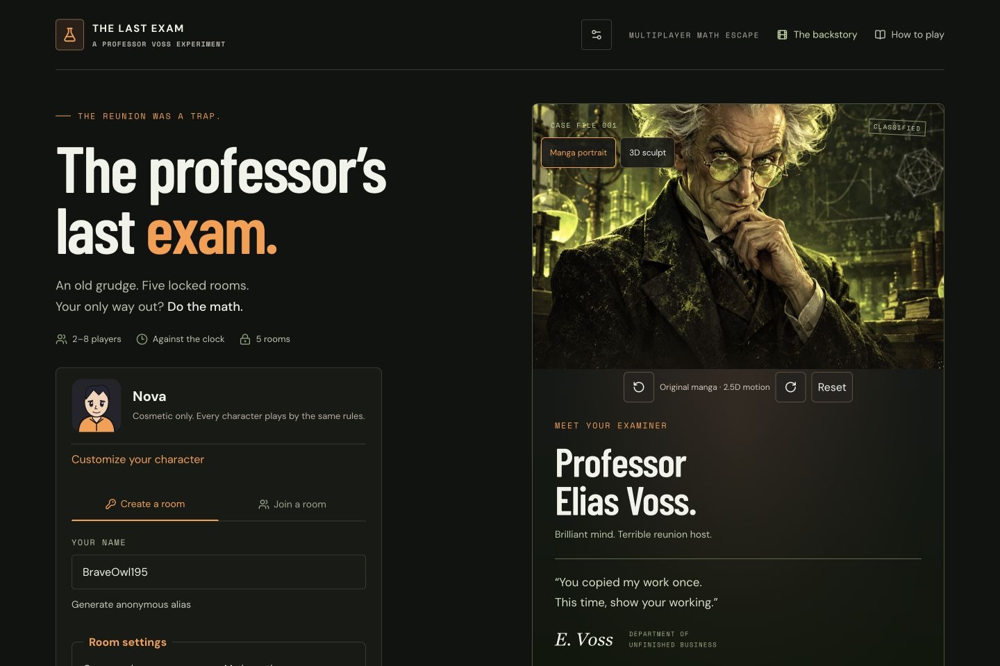

# The Final Exam — A Multiplayer Math Escape Room

**The Professor’s Last Exam** is a browser game for **2–8 human players, or one human racing against bots** joining from their own devices with a six-letter room code. Race to escape first, or cooperate to escape together. Professor Elias Voss has turned a college reunion into five rooms of school-level math, countdowns, and escalating detention.

> An old grudge. Five locked rooms. Your only way out? Do the math.

## Features

- Race with individual locks, clocks, hints, scores, detention, live standings, and final results.
- Co-op with human teammates and shared progress; room-code joining and host migration.
- Optional bots fill Race rooms up to eight total seats, with independent skill settings.
- Eight original SVG manga avatars, cosmetic customization, anonymous aliases, and persistent browser preferences.
- Orange actions/focus, touch targets, responsive layouts, and reduced motion.
- Preserved HD manga Voss with interactive 2.5D movement; optional original full-body Three.js sculpt.
- Mandatory opening cinematic, readable white speech clouds, original local soundtrack, and pause/resume.

## Preview



[Opening cinematic](docs/cinematic-preview.jpg) · [Live race](docs/race-preview.jpg)

## Backstory and cinematic

Thirty years ago, Elias Voss spent months on his college team’s mathematics research. At the science fair, his friends received the award while his name was missing. He walked away before they could explain. Their letters stayed unopened; a printing error became a betrayal in his mind.

Years later, Voss turned his science lab into a revenge experiment. He wired number locks into doors, installed countdowns, and built detention rooms. Then he invited his old teammates to a reunion. You must solve the locks and discover the truth in their unopened letter.

Every page load begins with **The Missing Credit → The Grudge → The Experiment** before revealing the homepage. Press **Start story** once; each chapter receives twelve visible, unpaused seconds. There is no skip, chapter jump, premature enter button, or Escape dismissal. Hidden tabs pause playback. Pause/resume and sound controls remain available. Reduced motion removes camera movement while retaining automatic progression.

This is a cinematic made from animated HD artwork, not a rendered video file. Its original laboratory soundtrack is synthesized locally in the browser. Audio needs a user gesture and can be muted. Captions and dialogue remain readable text. [Artwork notes](docs/story-art.md) document the original panels.

The original manga professor is the default interactive view. Mouse motion, touch tap/horizontal drag, and labelled movement/reset buttons provide bounded **2.5D parallax**. This does not reconstruct the artwork as a 3D model. The optional **3D sculpt** is an original toon-shaded, full-body Three.js Voss with articulated head/torso/arms, silver hair, glasses, coat, notebook, and lab props. It lazy-loads, pauses when hidden/offscreen, resizes to its container, respects reduced motion, and disposes graphics resources. WebGL failure retains the manga portrait. Touch panels preserve vertical page scrolling.

## How to play

1. Complete the opening story, then preview your character and edit your anonymous alias (1–20 characters).
2. Create a room with mode, mathematics, time pressure, and optional bot settings; or join by code.
3. Share the code or invitation link. Each human joins from their own browser/device. Humans joining the lobby replace bot seats.
4. In **Race with bot filling enabled**, one connected human can race against seven bots. Co-op and Race without bots require at least two humans. Invite friends before readying up: humans replace bot seats until the countdown begins.
5. When every human is connected and presses **I’m ready**, the server automatically starts a **10-second lab-loading countdown**. Watch Voss seal the doors, restore power, hide clues, and arm the locks. Puzzle timers and bots start only when the countdown ends.
6. Search the **abandoned science laboratory**: tap the dusty notebook, chemical bottles, and broken terminal to reveal math clues. Use **Highlight objects** for free or expand **Search objects with labelled controls** for keyboard/touch access. Clue discovery survives reconnects; Race discoveries are private and Co-op discoveries are shared.
7. Choose a lock and submit its numerical answer. Fractions and equivalent decimals are accepted; omit units and equations. Invalid input has no penalty.
8. Solve all three main locks to clear a room. Race advances automatically after a three-second summary. Co-op lets the host advance after the team reads the explanations.

**Race:** same questions for all racers, but only your submissions change your locks, clock, hints, score, and punishment. The first successful escape wins. Others continue until they escape, lose, or explicitly leave. Final results appear when everyone has finished. Your solved explanations remain available in **Your solved questions**; opponents’ hints and explanations are private.

**Co-op:** humans share locks, time, hints, score, and punishment. A teammate’s correct answer helps everyone. There are no bot teammates in Co-op. Use the room channel to coordinate.

The host can change lobby settings; a change resets human readiness so players acknowledge the new rules. Character/alias edits are lobby-only. Sound and motion settings are available throughout play. Customization gives no gameplay advantage. Aliases must be unique in the room, case insensitive; the server validates catalog colors/accessories and authorizes only the caller’s own profile.

## Mathematics

**Junior:** classes 5–8. **Senior:** classes 9–12. These control the questions, independently of time pressure and bot skill. Questions grow harder across the rooms, within the selected range. The existing authored bank is preserved.

| Room                    | Theme                          | Junior examples                       | Senior examples                                 |
| ----------------------- | ------------------------------ | ------------------------------------- | ----------------------------------------------- |
| 1. The Abandoned Laboratory | Arithmetic and patterns        | Order of operations, number sequences | Signed numbers, more involved patterns          |
| 2. The Fraction Factory | Fractions, ratios, percentages | Fractions of amounts, discounts       | Fraction addition, successive percentages       |
| 3. The Algebra Alarm    | Equations and powers           | One-step and two-step equations       | Linear equations, exponent rules, square roots  |
| 4. The Geometry Trap    | Shapes and measurements        | Area, perimeter, triangle angles      | Pythagoras, circle area, a trigonometric ratio  |
| 5. The Final Exam       | Mixed final challenge          | Equations, probability, averages      | Simultaneous equations, probability, quadratics |


These are approachable questions within the selected range, not complete coverage of every syllabus. Required geometry formulas appear in prompts. Detention uses familiar, simpler math for both mathematics settings.

## Rules, scoring, and punishment

| Time pressure | Easy | Medium | Hard |
| --- | ---: | ---: | ---: |
| Main-room countdown | 300s | 240s | 180s |
| Wrong-answer penalty | −5s | −10s | −15s |
| Hint penalty, once per puzzle | −10s | −15s | −20s |
| Detention level 1 | 90s | 60s | 45s |
| Detention level 2 | 120s | 90s | 60s |
| Detention level 3 | 150s | 120s | 90s |
| Time after clearing detention | 150s | 120s | 90s |

- Correct answers add **20 seconds**; main puzzles also award **100 points**.
- Clear a main room for one bonus point per whole second remaining.
- A main timeout removes **100 points**, clamped to zero, and raises punishment by one.
- Level 1 detention has one puzzle; level 2 has two; level 3 has two fragments and a dependent exit-code lock.
- Clear detention to resume the unfinished main room. Solved main locks stay open; punishment does not reset.
- Correct detention answers add time but no puzzle points; wrong answers and hints use the normal penalties.
- Fail detention or miss a fourth main deadline and the attempt ends. Clearing all five main rooms is an escape.

Medium preserves the original approved scoring rules. Punishment belongs to each racer in Race and to the team in Co-op. A wrong answer removes time; punishment rises only when a main deadline expires, including penalties that push the clock to zero.

### Bot behavior

| Bot skill | Delay between attempts | Answer accuracy |
| --- | --- | ---: |
| Easy | 25–45 seconds | 55% |
| Medium | 14–25 seconds | 75% |
| Hard | 8–16 seconds | 90% |

Bots are simulated opponents, not AI/ML models. The server samples seeded attempt delays and success/failure, then uses the same numerical answer validator and penalties as humans. BOT badges identify them. Delay and accuracy control simulated skill, separately from game time pressure. New Race rooms fill vacant seats by default: one human produces seven bots; two humans produce six bots; eight humans produce none. Bot filling can be disabled.

Scheduled actions and deadlines are processed in chronological server time. Extra polling cannot accelerate bots or award duplicate points. If nobody sends requests, the server catches up from the original timestamps on the next authenticated request; reconnecting grants no extra time. A disconnected human’s timer continues; an explicit leave ends that racer’s participation. Departed racers remain in final results. All humans leaving stops the bots. A host absent for 30 seconds is replaced by a connected human.

**New-room defaults:** Race, Junior, Medium time pressure, Medium bot skill, bot filling enabled. Older stored rooms normalize to Co-op/Medium with default avatars.

<details><summary>Story ending — spoilers</summary>
The unopened letter reveals a printing error. His friends tried to correct the missing credit, but Voss never read their messages. Escape reveals the misunderstanding.
</details>

## Run locally

Project location: `/Users/sujaygopal/Desktop/MyProjects/The-Final-Exam---A-Multiplayer-Game`.

Requires **Node.js 24.x** and npm. The deployment target is now native Next.js, React, TypeScript, and Three.js. Local games use SQLite; Vercel games use a remote Turso/libSQL database. Settings and private race progress retain the existing JSON schema.

```sh
cd "/Users/sujaygopal/Desktop/MyProjects/The-Final-Exam---A-Multiplayer-Game"
nvm use 24
git switch main
npm run install:ci
npm run dev
```

No local database migration command is needed. The server automatically reuses the preserved `.wrangler/state/v3/d1/miniflare-D1DatabaseObject` SQLite file, or creates `.data/rooms.sqlite` in a clean clone. If several legacy files exist, choose one with `GAME_SQLITE_PATH`. The local adapter uses `CREATE TABLE IF NOT EXISTS`; it does not reset existing rooms.

The dev server listens on `0.0.0.0:5173`. Local access: `http://localhost:5173`. Phones on the same network use `http://YOUR_COMPUTER_LAN_IP:5173`. Keep the computer awake and the server running. LAN IPs can change. A phone’s localhost points at the phone itself.

Browser storage holds the device’s profile/preferences and current session credential. Do not share the credential. Rooms expire after 24 hours. New humans join only in the lobby; existing sessions reconnect on their original browser. Two tabs in one browser normally share identity—use another device, browser, or private window for another human.

## Deploy on Vercel

See [the deployment guide](docs/vercel-deployment.md) for database setup and project settings. Vercel Production builds the complete game from GitHub `main`.

The prior `npm run build` invoked Vinext and wrote Cloudflare output under `dist/`; Vercel's Next.js preset expected `.next/routes-manifest.json`. The build now runs `next build`, and `vercel.json` pins the framework, install command, build command, and `.next` output. Do not restore the Vinext build command or choose `dist` as Vercel's output directory.

Set **both** `TURSO_DATABASE_URL` and `TURSO_AUTH_TOKEN` as server-only Vercel environment variables, then redeploy. The first multiplayer request creates the `rooms` table if needed. Builds do not need database credentials; multiplayer requests do. Hosted requests fail with 503 when the database is unconfigured rather than writing separate ephemeral files on different server instances.

The former Vinext/Sites tooling remains in the repository for historical reference; the standard npm commands and game API now target Next.js/Node on Vercel. Returning to Sites requires its original runtime adapter. The previous `codex/race-bots` branch remains available as the Cloudflare version.

## Verify

```sh
npm test
npm run typecheck
npm run build
node scripts/check-vercel-build.mjs
# With the local preview running:
node tests/integration.mjs
node tests/profiles-http.mjs
node tests/race-http.mjs
```

Controlled-clock tests cover original Co-op rules, pressure settings, isolated detention, automatic progression, deadline catch-up, first escape/final ordering, host migration, bot scheduling independent of polling, reconnects, legacy state, and all 3200 avatar combinations. HTTP tests cover eight humans, two humans plus six bots, replacement/capacity, concurrent submissions, idempotency, settings/profile permissions, alias validation, and private snapshots. Storage tests also cover preserved local data, remote credential validation, the real SDK against a local Hrana HTTP fixture, collision handling, expiry, and versioned concurrent writes. GitHub CI checks the native Next.js manifests and runs HTTP tests against the production server with a disposable local database.

For manual UI checks: try 375/390px phone widths and desktop; customize then reload; change profile in the lobby; toggle sound/motion during play; use pointer/touch and keyboard movement/reset controls; switch between portrait/sculpt; test a device without WebGL. Complete the cinematic and verify reload replays it. Real physical phone touch and classroom playtesting remain useful beyond browser viewport checks.

## Architecture and learning

- `lib/game.ts`: shared rule functions operate on either one cooperative progress record or a private record per racer; bots use the same validator.
- `lib/game-settings.ts`: pressure/skill tables and validated room settings.
- `lib/game-types.ts`: public contracts; `lib/puzzles.ts`: server-only authored question/answer bank.
- `app/api/game/route.ts`: session authentication, room creation/joining, viewer-specific snapshots, and versioned SQL updates.
- `db/index.ts`, `db/config.ts`, `db/sql-store.ts`, `db/local.ts`, `db/remote.ts`: server-only storage selection and the shared parameterized SQL/CAS contract.
- `lib/use-game.ts`: polling every 1.2 seconds, reconnects, and server-clock synchronization.
- `lib/profiles.ts`, `components/avatar.tsx`, `components/profile-editor.tsx`: validated cosmetic catalog and original SVG art.
- `lib/use-preferences.ts`: browser preference persistence; `components/room-settings.tsx`: lobby controls.
- `components/game.tsx`: personal puzzle board, room channel, standings, and own-question review.
- `components/prologue.tsx`, `components/professor.tsx`, `components/professor-scene.tsx`: cinematic, preserved manga motion, and optional original 3D figure.

**Server authority:** deadlines and numerical validation live on the server. Browser timer edits cannot change rules. Race snapshots include only the authenticated player’s puzzles/explanations and opponents’ public progress; session tokens, RNG state, scheduled attempts, and private progress are excluded.

**Optimistic concurrency:** a room update succeeds only if the stored version still matches the version read. Concurrent requests reload/retry on conflict. This prevents lost updates and duplicate awards. Seeded bot state is persisted through the same update, so retries do not create additional actions.

**Live synchronization:** this is polling, not WebSockets. Changes generally appear within one polling interval plus network latency. Timers use server timestamps and catch up on requests, including when everyone was disconnected.

## Debugging and limitations

- Database unavailable: inspect the server log; on Vercel check both Turso variables and the database connection. The first request creates the `rooms` table. For local play leave the remote variables unset. See the deployment guide.
- Cannot start: every human must be connected and ready. Race with bots permits one human; Co-op and Race without bots require two. The countdown begins automatically. An upgraded lobby asks humans to ready up again.
- Phone cannot connect: use the computer’s LAN IP, same network, awake host, and allow port 5173 through the firewall/router.
- Stale-phase error: review the new room before resubmitting; the prior answer was not accepted into a different room.
- Silent audio: press Start story or a sound button; browsers require a gesture. Check the mute preference.
- No 3D: use the preserved portrait; WebGL may be unavailable. Clear hot-reload hook errors by refreshing.

The fixed bank contains 30 main puzzles and six detention steps. Replays repeat questions. Bots simulate skill; they do not learn. Tests validate room-level correctness, not large-scale load. There are no app accounts, global leaderboard, or ML inference. Optional fresh-number templates vary selected puzzles; the authored bank remains available. Public deployment still benefits from abuse protection and classroom testing. The remote database adapter is tested locally through its SQL contract; hosted room creation should be verified after connecting Turso.

## Feature PRs and future updates

These feature branches preserve the development history; their work is included in `main`:

| Branch | PR target | Responsibility |
| --- | --- | --- |
| `codex/ui-orange-3d` | `main` | Orange UI, cinematic, preserved interactive manga, optional 3D |
| `codex/player-profiles` | `codex/ui-orange-3d` | Original avatars, aliases, persistent settings, profile authorization |
| `codex/race-bots` | `codex/player-profiles` | Race, pressure/skill settings, deterministic bots, private progress |
| `codex/vercel-compat` | `codex/race-bots` | Native Next.js output, portable SQL storage, Vercel configuration and checks |

The latest game and deployment fixes are on `main`. Existing feature branches and Git history are retained. Keep future changes focused, test them, and open a PR. See [CONTRIBUTING.md](CONTRIBUTING.md).

## Portfolio explanation

**Resume bullet:** Built a 2–8-player math escape game with independent competitive progress, deterministic simulated opponents, cosmetic profiles, server-authoritative deadlines, and versioned SQLite updates; validated concurrency and private snapshots through rules and HTTP tests.

**Project description:** A narrative browser party game where students race or cooperate to solve progressively harder school math under time pressure.

**Interview explanation:** I reused one rules engine for shared and private progress, separated question level from time pressure/opponent skill, and processed seeded bot actions in logical server time. Versioned database writes and replay receipts prevent duplicate awards; viewer-specific snapshots protect opponents’ explanations.

**Recruiter explanation:** Friends join by code on their phones, customize characters, and escape a professor’s lab by solving math. Small groups can compete against clearly labelled computer opponents.

### Solve feedback and cosmetic streaks

Correct answers show lock-opening feedback and a streak badge. Three consecutive correct answers earn **Sharp mind**; five earn **Lab legend**. These are cosmetic: +100 points per main lock and +20 seconds per correct answer remain unchanged. A wrong answer or missed deadline breaks the current streak. Co-op shares a team streak; Race keeps each streak private. Mobile answer controls stay visible while scrolling within the question panel. System/browser reduced motion and the player's motion setting disable the lock animation.

### Fresh puzzle variations

New rooms enable **Fresh numbers each round**. Selected arithmetic, fraction, percentage, and algebra locks use bounded seeded templates. Every seat receives the same stored question set; reconnecting cannot regenerate it. Answers and explanations stay on the server until each player's rules allow disclosure. A rematch changes the numbers, while Junior/Senior topics and all time-pressure rules stay the same. Turn the toggle off for the original authored bank; legacy rooms keep their existing questions. Detention questions retain their original prerequisite/code rules.

Run `node tests/fresh-http.mjs` against your local production server to check generated questions through the real multiplayer API.

### Best-of-three rivalries and rematches

In Race, enable **Best-of-three rivalry** in Room settings before starting. The first successful escape earns one round win. The series ends when a racer reaches two wins or after three completed rounds. If several racers tie for the most wins after three rounds, the series is a draw; a round with no escape awards no win. Bots can win rounds and are always labelled BOT.

After every racer finishes or leaves, all remaining humans can vote for the next round. Every remaining connected human must vote (one is sufficient in a bot-filled Race, otherwise at least two are needed); the room then returns to the lobby, and everyone must ready up again. Profiles, settings, and series wins persist. Settings and roster additions are locked between rivalry rounds, while lobby alias/avatar edits remain available. The host can explicitly end an unfinished rivalry after a round, or set up a new rivalry after completion. Standard Race and Co-op also offer consensus rematch votes.

Results show the round podium and your answer accuracy, elapsed time, and best streak. Accuracy includes all accepted main/detention submissions; hints and malformed answers are excluded. Time includes room summaries and detention, and freezes when you finish. Co-op displays the team's aggregate recap. Series records live only in the room and expire with its existing 24-hour lifetime.

Run all checks with Node 24:

```sh
npm test
npm run typecheck
npm run build
node scripts/check-vercel-build.mjs
GAME_SQLITE_PATH=/tmp/final-exam-engagement-test.sqlite npm start
```

In another terminal, run `node tests/integration.mjs`, `node tests/profiles-http.mjs`, `node tests/race-http.mjs`, `node tests/fresh-http.mjs`, `node tests/series-http.mjs`, and `node tests/lab-http.mjs`. The series HTTP test plays two full rounds, including entry countdowns, and takes about 75 seconds. Use `GAME_TEST_URL=http://localhost:5174` if your test server uses another port. New-room defaults remain Race/Junior/Medium with bot filling on; fresh numbers are on and rivalries are opt-in.

Feature branches: `codex/solve-feedback` → `codex/fresh-puzzles` → `codex/rivalry-series` → `codex/lab-entry`. The final branch also includes the automatic lab-entry sequence and interactive laboratory. Keep their dependent PRs open until reviewed.

Portfolio explanation: a server-authoritative game generates fair deterministic challenges, protects private progress, and coordinates replay-safe multiplayer series. Retention improvement is a hypothesis to measure through playtesting, not a claimed result.


### Laboratory entry checks

The lab scene uses original local WebP artwork with native button hotspots. It is an illustrated room, not a 3D environment. Mathematics and scoring are unchanged. The startup progress is part of the story; actual server/network errors are shown separately. Audio/motion preferences and the mandatory manga opening still apply.

Run `npm test`, `npm run typecheck`, `npm run build`, and `node scripts/check-vercel-build.mjs`. Start a disposable production server with `GAME_SQLITE_PATH=/tmp/final-exam-lab-test.sqlite npm start -- --port 5174`, then run `GAME_TEST_URL=http://localhost:5174 node tests/lab-http.mjs`. That test waits for the real ten-second transition, checks solo bots, rejected early answers, duplicate readiness, exact timer start, and reconnect discovery.

For a manual check, create a Race with bots and press **I’m ready**. Watch 10 → 0, search all three objects, submit a correct/wrong answer, and refresh to check discoveries. Repeat with two humans and eight humans. Use Tab/Enter to open labelled objects; check a phone in portrait, reduced motion, muted sound, and a disabled/failed image load. Existing lobby readiness resets once on upgrade; existing matches retain their original timers.
